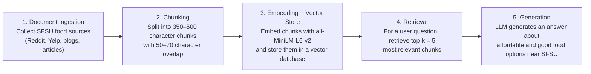

# Project 1 Planning: The Unofficial Guide

> Write this document before you write any pipeline code.
> Your spec and architecture diagram are what you'll use to direct AI tools (Claude, Copilot, etc.) to generate your implementation — the more specific they are, the more useful the generated code will be.
> Update the Retrieval Approach and Chunking Strategy sections if you change your approach during implementation.
> Update this file before starting any stretch features.

---

## Domain

<!-- What domain did you choose? Why is this knowledge valuable and hard to find through official channels? -->

My domain will cover what the best and afforadable options to eat within and outisde SFSU. This knowledge is valuable because people love to have options to point to when they are hungry and as a college student its always a good idea to try to save money when youre hungry. Its hard to find information like this through official channels because theres an innaccesibility when it comes to information about food places especially affordable options around or outside of campus. Ive come across many resources that are very dated and was writted way back towards 2012. Also there arent yelp pages for all dining options around sfsu and if there is information about the place is very vague. Sometimes yelp reviews are also vague and might not reflect an accurate depiction of the dining place within or outside of sfsu. Information is also repetetive, information accross resources can hold the same descriptions for the same restaurants.

---

## Documents

<!-- List your specific sources: URLs, subreddit names, forum threads, or file descriptions.
     Aim for at least 10 sources that together cover different subtopics or perspectives within your domain. -->

| # | Source | Type | URL or file path |
|---|--------|------|-----------------|
| 1 | Best Food on Campus or off (sfsu reddit) | forums | https://www.reddit.com/r/SFSU/comments/1fe4on9/best_food_on_campus_or_off/ |
| 2 | hall of flame burger reviews (yelp) | reviews | https://www.yelp.com/biz/hall-of-flame-burgers-san-francisco?osq=Restaurants+Near+Sfsu&sort_by=elites_desc |
| 3 | cafe roso reviews (yelp) | reviews | https://www.yelp.com/biz/cafe-rosso-san-francisco?sort_by=elites_desc |
| 4 | blog post of top 5 places to eat off campus (goldengateexpress) | blog post | https://goldengatexpress.org/113255/opinion/opinion-top-five-off-campus-eateries-around-sfsu/ |
| 5 | halal shop yelp reviews (yelp) | reviews | https://www.yelp.com/biz/halal-shop-san-francisco-2?osq=Restaurants+Near+Sfsu&sort_by=elites_desc |
| 6 | natural selections yelp reviews (yelp) | reviews | https://www.yelp.com/biz/natural-sensations-san-francisco?sort_by=elites_desc |
| 7 | blog post about monarca a food dining hall (goldengateexpress) | blog post | https://goldengatexpress.org/107839/opinion gator-take-monarca-dining-hall-formerly-city-eats-is-not-bad/ |
| 8 | blog post about top places to eat around sfsu form society 19 (society19) | article | https://www.society19.com/guide-eating-sfsu-campus/ |
| 9 | article about campus restaurant run by sudents | food | https://www.smpltxt.net/2024/12/18/beyond-routine-san-francisco-states-elevated-dining/ |
| 10 | an article about top places to eat around sf as an sfsu student (xpressmagazine) | article | https://xpressmagazine.org/5585/fall-2013/the-best-of-san-francisco-sf-state-edition/ |

---

## Chunking Strategy

<!-- How will you split documents into chunks?
     State your chunk size (in tokens or characters), overlap size, and explain why those
     numbers fit the structure of your documents.
     A review-heavy corpus warrants different chunking than a long FAQ. -->

**Chunk size:**
350-500 characters
**Overlap:**
50-70 characters
**Reasoning:**
Im going to keep my chunk size between 350-500 characters with 50-70 character overlap to ensure factual information is kept within my source. This chunk and overlap size ensures that im getting the right ammount of information per source, its not too big or too small and if done/ implemented correctly can help the llm text embeddings to provide proper context for the rag system.

---

## Retrieval Approach

<!-- Which embedding model are you using (e.g., all-MiniLM-L6-v2 via sentence-transformers)?
     How many chunks will you retrieve per query (top-k)?
     If you were deploying this for real users and cost wasn't a constraint, what tradeoffs
     would you weigh in choosing a different embedding model — context length, multilingual
     support, accuracy on domain-specific text, latency? -->

**Embedding model:**
all-MiniLM-L6-v2
**Top-k:**
k=5
**Production tradeoff reflection:**
If i were deploying this llm for real id want to be able to have a longer context length to work with. I think that being able to fuel my ai with larger context provides more accurate depictions of what people are saying about the kind of food in and around their campus. Having more context length to work with will also provide more flexibility with the resources Im using to create chunks with because instead of using outdated blog posts and yelp reviews i could crowd source my information directly as a student surveying my fellow classmates and staff. 

---

## Evaluation Plan

<!-- List your 5 test questions with their expected correct answers.
     Questions should be specific enough that you can judge whether the system's response
     is right or wrong. "What are good dining halls?" is too vague.
     "What do students say about wait times at [dining hall name] during lunch?" is testable. -->

| # | Question | Expected answer |
|---|----------|-----------------|
| 1 | Does the Vista Room have a set or rotating menu? | The Vista Room at SFSU as a wide variety of food options and a rotating menu every couple of months! |
| 2 | What is the finding hall called that student are usually aquitted with their first year at sfsu? | Yerba Buena Dining hall & Monarca/ City Eats |
| 3 | What neighborhoods is sfsu near to? | Ocean Ave & Lake Mercet (sunset?) |
| 4 | Whats a popular food item at the Halal shop at sfsu? | Chicken Tikka Masala over Rice |
| 5 | Where is the Vista Room at sfsu located? | Rm. 401, Burk Hall |

---

## Anticipated Challenges

<!-- What could go wrong? Name at least two specific risks with reasoning.
     Consider: noisy or inconsistent documents, missing source attribution, off-topic
     retrieval, chunks that split key information across boundaries. -->

1.  Im afraid that my sources might not offer the proper information on making accurate output for the user since a lot of reviews created by students can be brief and a lot of sources about my domain can be very outdated/ hard to look for.

2. 

---

## Architecture

<!-- Draw a diagram of your pipeline showing the five stages:
     Document Ingestion → Chunking → Embedding + Vector Store → Retrieval → Generation
     Label each stage with the tool or library you're using.
     You can use ASCII art, a Mermaid diagram, or embed a sketch as an image.
     You'll use this diagram as context when prompting AI tools to implement each stage. -->

---

## AI Tool Plan

<!-- For each part of the pipeline below, describe:
     - Which AI tool you plan to use (Claude, Copilot, ChatGPT, etc.)
     - What you'll give it as input (which sections of this planning.md, which requirements)
     - What you expect it to produce
     - How you'll verify the output matches your spec

     "I'll use AI to help me code" is not a plan.
     "I'll give Claude my Chunking Strategy section and ask it to implement chunk_text()
     with my specified chunk size and overlap" is a plan. -->

**Milestone 3 — Ingestion and chunking:**

**Milestone 4 — Embedding and retrieval:**

**Milestone 5 — Generation and interface:**
